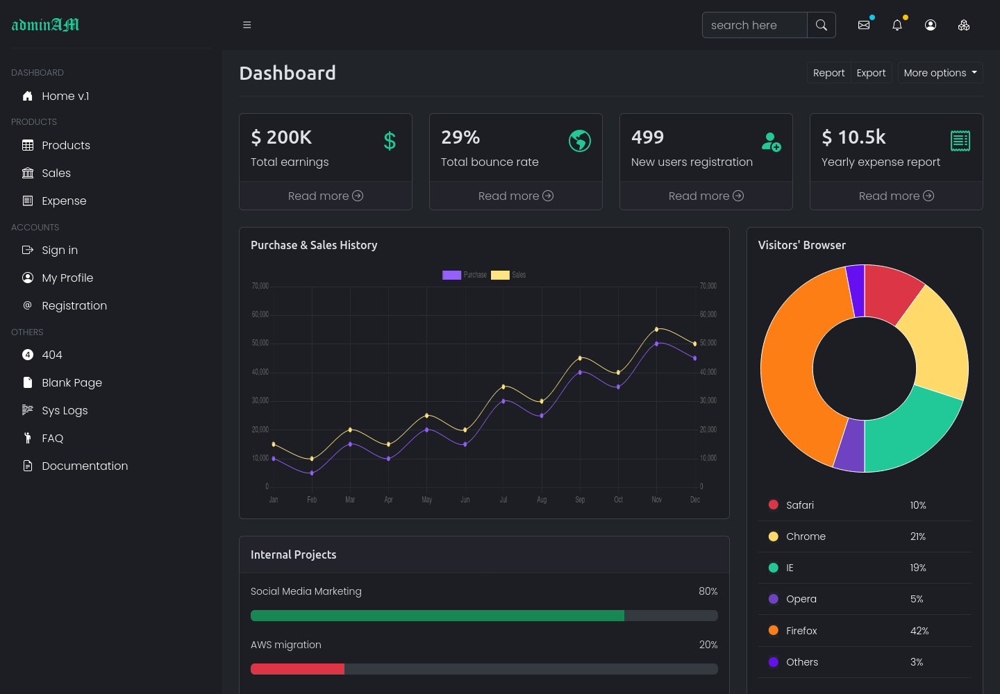

# adminAM - Bootstrap 5 Admin Template



This project titled as `adminAM` is an open source admin template created by www.amaharjan.de.

Initially started as a hobby project for a Django admin template. However, it has evolved to serve as an admin template for any customized web applications.

[Demo](https://asis2016.github.io/bootstrap-5-admin-template/)

## Quick Start

Jump-start your project with adminAM:

```bash
$ mkdir your_project_name
$ cd your_project_name
$ git clone https://github.com/asis2016/bootstrap-5-admin-template.git
```

## Dependencies & Plugins

The `adminAM` depends on the following frameworks and plugins:

- Bootstrap v5.3.2
- jQuery v3.6.4
- Chart.js v4.4.1
- jVectorMap v2.0.5
- plotly.js v1.58.5
- Bootstrap Icons v1.11.2
- Google Fonts

## Acknowledgements

- [Unsplash](https://unsplash.com/)

## Features

<ol>
    <li>404 page</li>
    <li>Account login page</li>
    <li>Account registration page</li>
    <li>Blank page</li>
    <li>Documentation page</li>
    <li>FAQ page</li>
    <li>Mail page</li>
    <li>Product</li>
    <ol>
        <li>Products list page</li>
        <li>Expenses report page</li>
        <li>Sales report page</li>
    </ol>
    <li>Profile page</li>
    <li>Search result page</li>
    <li>Single page</li>
    <li>System logs page</li>
    <li>Progressive Web App (PWA)</li>
</ol>

## Bugs and Issues
Have a bug or an issue with this template? Please [open a new issue](https://github.com/asis2016/bootstrap-5-admin-template/issues) here on GitHub.

## Contributing & Feedback
Contributions are always welcome! And, if you have any feedback or query, please reach out to me at hello@amaharjan.de.

## Buy me a coffee
Your gracious contribution through [PayPal](https://www.paypal.com/paypalme/asis2016) would very much support the development of this project.

## License
[MIT](./LICENSE)

